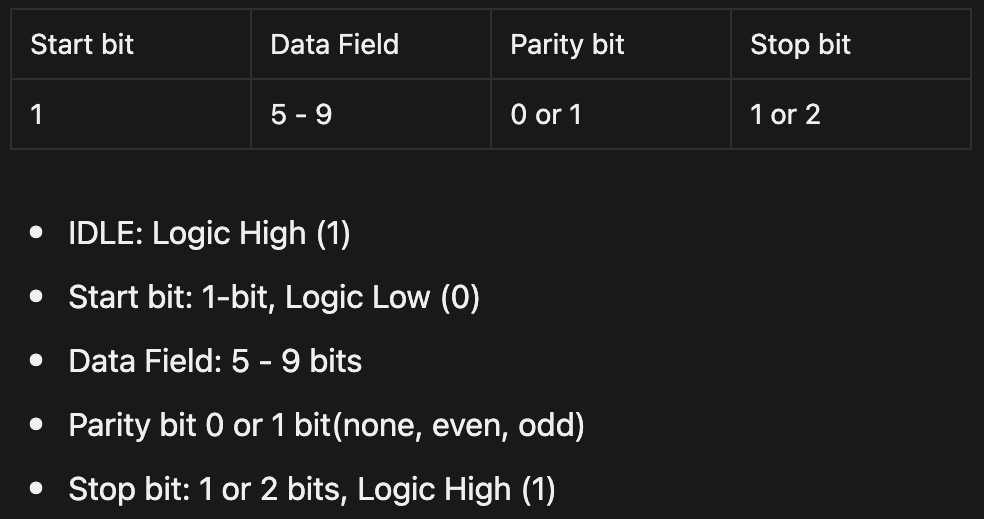

# UART_Interface

This projects implements and verifies a UART(Universal Asynchronous Receiver/Transmitter) design on an FPGA.

The UART module enables serial communication between the FPGA and a PC.  

## UART Frame

## Features
- Configurable baudrate, parity bit, and stop bit (fixed 8-bit data)
- Separate UART Tx and Rx modules
- Includes FIFO buffer in UART Rx module
- Verified using simulation and FPGA board (Arty A7-100T)

## Verification
- **Simulation**: Verified using Vivado simulator
- **Hardware Test**: Implemented on Arty A7-100T board and PuTTY

## Result

